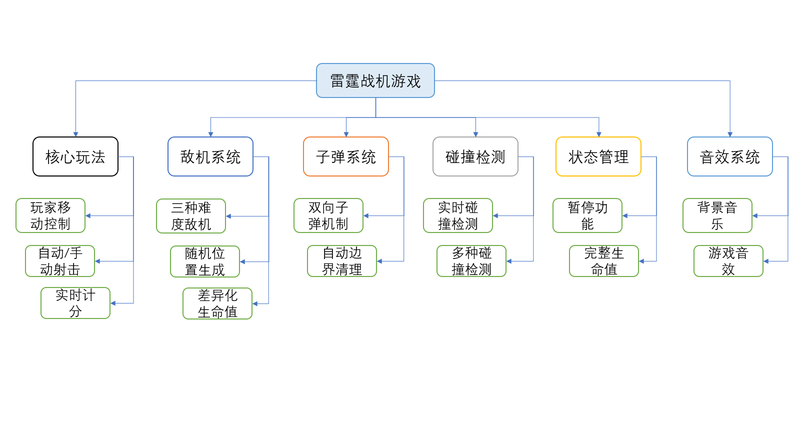

雷霆战机游戏
=============================
这是一款基于Qt框架开发的经典风格雷霆战机射击游戏。玩家通过键盘方向键操控太空飞船在场景中自由移动，使用空格键发射子弹攻击敌人。游戏中包含三种不同难度的敌机：简单敌机（10分）、中型敌机（15分）和重型敌机（20分），每种敌机拥有不同的生命值设定。
游戏采用实时碰撞检测系统，支持玩家子弹击毁敌机、敌机子弹攻击玩家（功能可启用）以及战机碰撞判定。内置真暂停功能可完全冻结游戏画面，配合背景音乐与多种音效系统，提供沉浸式游戏体验。游戏具备完整的生命周期管理，包含开始界面、实时计分显示和游戏结束统计。


(左右键可以左右移动战机，上下键可以上下移动战机)

[QT 6.6.0实现“雷霆战机”游戏（经典游戏回顾）](https://blog.csdn.net/Keep_Trying_Go/article/details/152664183)

视频讲解01：

视频讲解02：

代码下载地址01：

代码下载地址02：


功能实现
=============================

```
FlightShooting (主窗口)
├── GameScene (游戏场景)
├── PlayerSpaceship (玩家飞船)
├── EnemyController (敌人生成器)
├── Bullet (子弹类)
├── Enemy (敌人类)
├── CollisionDetector (碰撞检测器)
└── ScoreManager (分数管理器)
```



🎮 核心功能
----------------------------

* ​玩家控制​​：方向键移动 + 空格键射击
* ​三种敌机​​：简单(10分)、中型(15分)、困难(20分)不同生命
* ​双向子弹​​：玩家子弹向上、敌机子弹向下（敌机射击暂未启用，小伙伴也可以把代码注释去掉即可）
* ​实时碰撞​​：子弹击毁敌机、玩家与敌机碰撞即结束

⏯️ 状态管理
----------------------------
* ​真暂停系统​​：完全冻结画面，所有物体停在当前位置
* ​完整生命周期​​：开始→进行→结束→清理资源

🎵 音效系统
----------------------------
* 背景音乐循环播放
* 射击、爆炸、游戏结束音效

📊 计分系统
----------------------------
* 实时分数显示
* 按敌机类型差异化计分
* 最终成绩统计

🎨 界面功能
----------------------------
* 开始/暂停/关闭按钮
* 网格背景场景
* 抗锯齿渲染显示


打包QT程序为exe文件
===============================
[打包工具下载链接](https://enigmaprotector.com/en/downloads.html)

[打包工具安装教程](https://blog.csdn.net/qq_39172792/article/details/145546784?ops_request_misc=&request_id=&biz_id=102&utm_term=enigma%E6%89%93%E5%8C%85%E5%B7%A5%E5%85%B7%E4%B8%8B%E8%BD%BD&utm_medium=distribute.pc_search_result.none-task-blog-2~all~sobaiduweb~default-0-145546784.142^v102^pc_search_result_base4&spm=1018.2226.3001.4187)

[打包工具使用教程](https://blog.csdn.net/qq_35246754/article/details/130831140)


参考链接（推荐）
===============================
漂亮的图标网站
-------------------------------
https://unicode.org/emoji/charts/full-emoji-list.html

https://getemoji.com/

https://emojipedia.org/emoji-mashup/twitter/twemoji-14.0?a=%F0%9F%98%80&b=%F0%9F%98%86

https://www.iconfinder.com/

https://www.flaticon.com/


